<link rel="stylesheet" href="reveal_custom.css">

<link rel="stylesheet" href="https://cdn.jsdelivr.net/gh/jpswalsh/academicons@1/css/academicons.min.css">

  
  
  

## Rainfall Estimates on a Gridded Network (REGEN)

Steefan Contractor

 

Contractor, S., Donat, M. G., Alexander, L. V., Ziese, M., Meyer-Christoffer, A., Schneider, U., Rustemeier, E., Becker, A., Durre, I., and Vose, R. S.: Rainfall Estimates on a Gridded Network (REGEN) – a global land-based gridded dataset of daily precipitation from 1950 to 2016, Hydrol. Earth Syst. Sci., 24, 919–943

---

# Basic description

- Daily estimates over 1950 - 2016 
- Gridded 1 degree latitude x 1 degree longitude resolution
- Global land coverage

---

# Purpose

- Purpose built for climate studies with a long temporal record and consistent global spatial analysis
- Based on a large in situ archive from combining GPCC with GHCN-Daily among others
- Includes various statistical model error estimates
- Also includes guidance for users less aware of issues with in situ based precipitation observations

---

# In Situ Station Archive Description

  

- Total stations: 135,178
- Around 50K stations for each day
- Min stations per day: 35,460
- Max stations per day: 56,190

  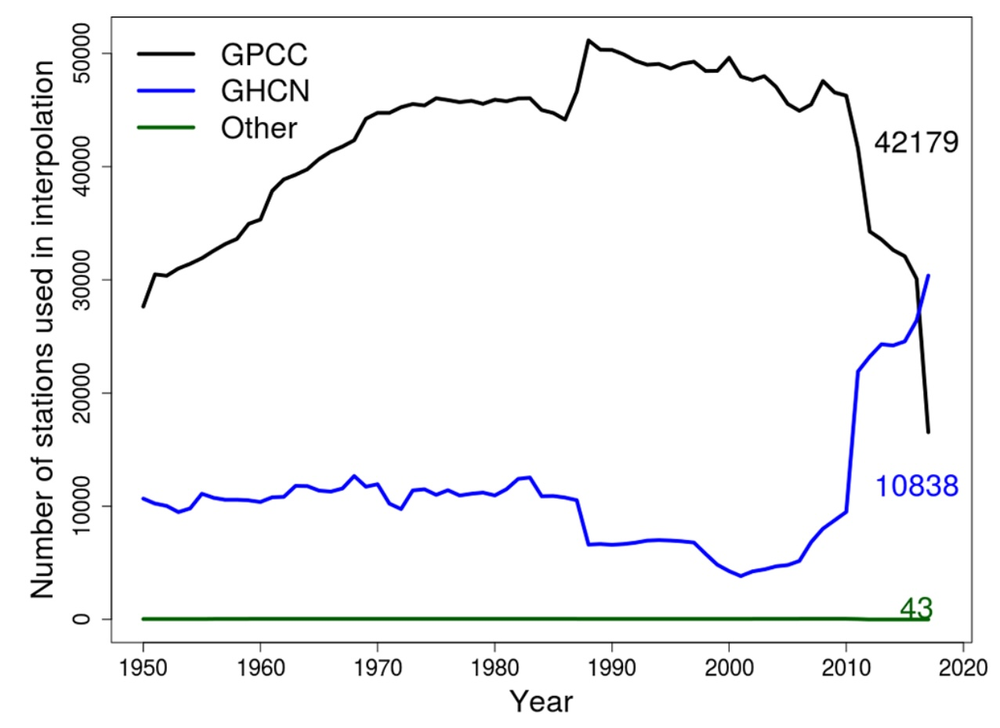
  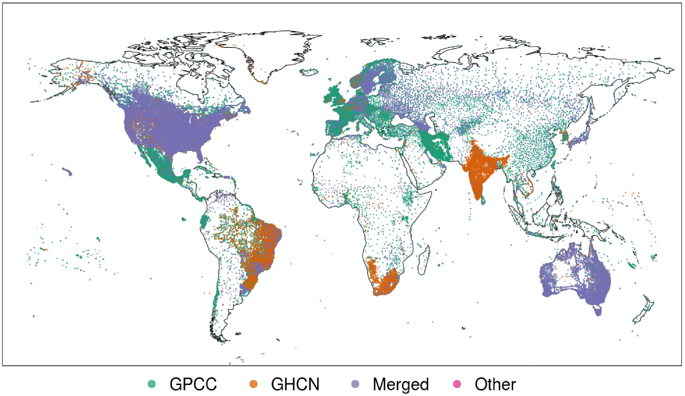

---

# Component In Situ Archives

##### Three sources:

- GPCC stations
- GHCN-Daily stations
- Collected during GEWEX workshops

##### Merging algorithm:

- Lat + Lon match and
- World Met. Org. (WMO) ID match or missing

Or

- Coordinates within 1º of each other and
- WMO ID match or missing and
- 0.99 correlation between timeseries with 365 days of data of which at least 10d with >1mm precip

---

# Quality Control Procedures

- The automated QC procedures were identical to those applied to GHCN-Daily (Durre et al. 2010)
- The procedure included two stages
- Stage 1 does temporal checks
  - multi-day accumulations
  - duplicate data within timeseries
  - frequent occurance of values
  - world record exceedances
  - outlier checks
  - temporal consistency checks
- Stage 2 does spatial checks
  - checks whether values are consistent with negihbours

 

Durre, I., Menne, M. J., Gleason, B. E., Houston, T. G., and Vose, R. S.: Comprehensive automated quality assurance of daily sur- face observations, J. Appl. Meteorol. Clim., 49, 1615–1633

---

# Interpolation Algorithm

- Ordinary Block Kirging
- Best Linear Unbiassed Estimator (BLUE)
- Linear because the estimate is a weighted average of surrounding stations

$$\mathbf{Z}^*(s_0) = \sum_{i=0}^{N} λ_i\mathbf{Z}(S_i)$$

- Best because we use the spatial structure (covariance) to determine the value of the weights
- Unbiassed because the weights are constrained to add up to 1 and so the result cannot be biassed to any one station

$$\sum_{i=1}^N λ = 1$$

- Ordinary Kriging assumes second order stationarity (mean and variance constant across domain)

$$\mathbf{Z}^*(s_0) = μ + ε(s_0)$$

- Block implies that the algorithm produces gridded area-average estimates as opposed to point estimates

---

# Two Flavours: All stations and Long Term Stations Only

- The All stations based dataset interpolates all underlying stations
- The Long Term version interpolates only stations with 40 complete years of data
- A year is complete if all 12 months had at least 70% non-missing days

---

# Uncertainty aware guidance for users

 

- The uncertainty info includes Kriging Error (KE): a weighted average of modeled variance (between interpolation location and stations) and depends solely on the spatial distribution of stations and grid size, and
- Yamamoto coefficient of variation (CV) (Yamamoto et al. 2000): weighted (by Kriging weights) average error between the estimate and the station values
- Number of stations used for each grid estimate is also included

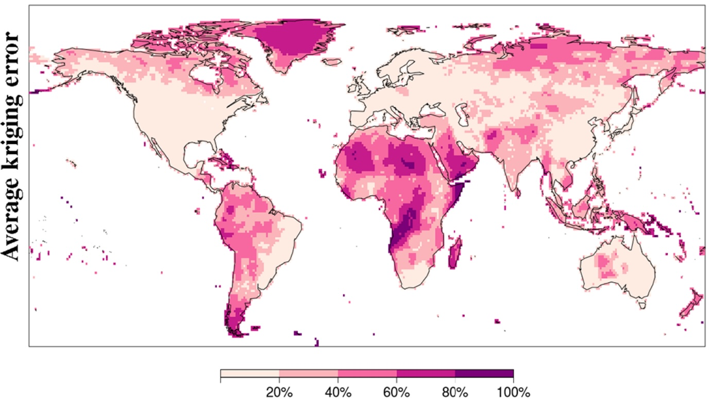
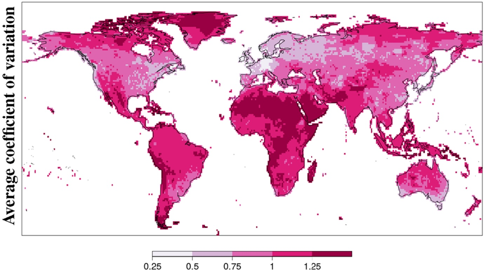

Yamamoto, J. K.: An Alternative Measure of the Reliability of Ordinary Kriging Estimates, Math. Geol., 32, 489–509

---

# Quality Masks

A grid cell was left unmasked if:

- It contained 60% of days in every decade with at least 1 station, and 
- both the KE and CV were under the 95th percentile (spatial distribution) of the temporally averaged (over 1950 - 2016) KE and CV respectively

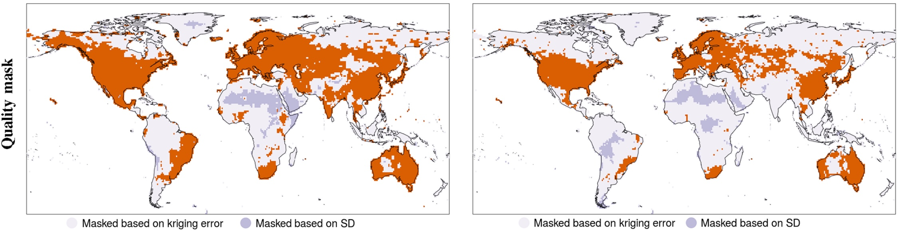

---

# Comparison with other global gridded datasets of monthly precipitation

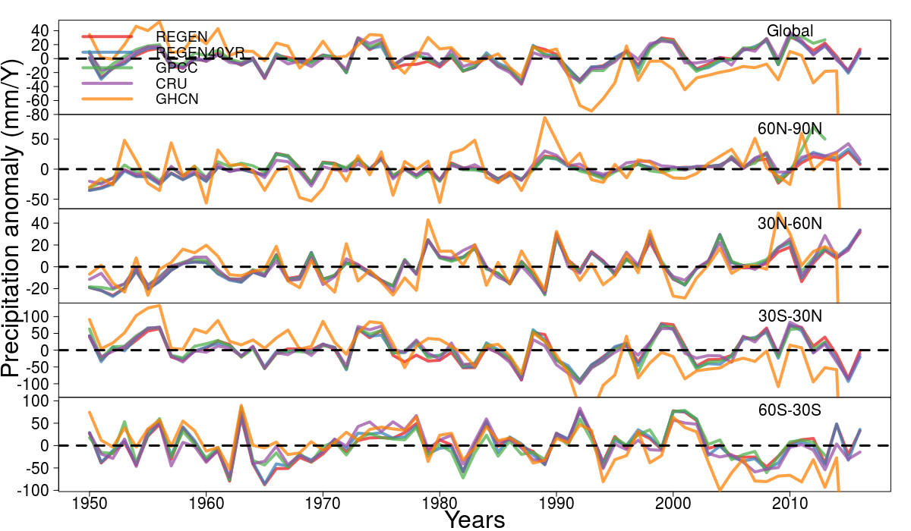

---

# Comparison with other global gridded datasets of daily precipitation

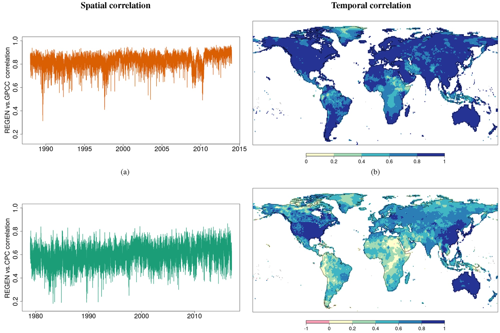

---

# Comparison with regional daily precipitation datasets

Mean difference

SD of difference

Temporal correlation

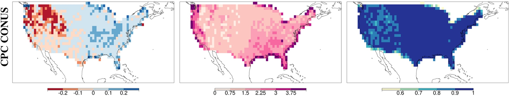
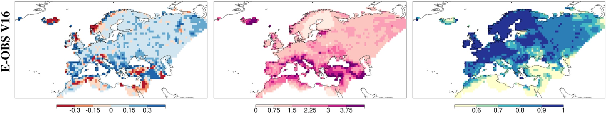
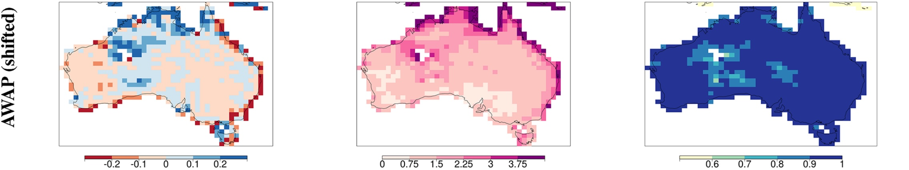
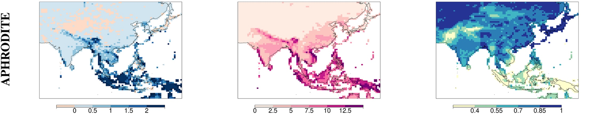
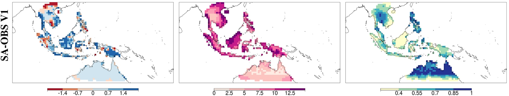

---

# Application: Global changes in precipitation

Trends in annual precipitation (1950 - 2016) (mm/yr)

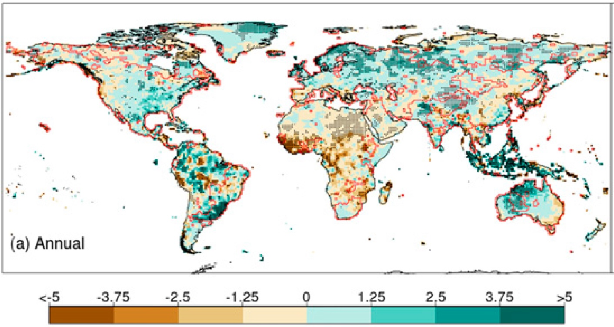

Contractor, S., Donat, M. G., & Alexander, L. V. (2021). Changes in Observed Daily Precipitation over Global Land Areas since 1950. Journal of Climate, 34(1), 3–19.

Wet-day frequency changes between 1950-1983 and 1984-2016 (%)

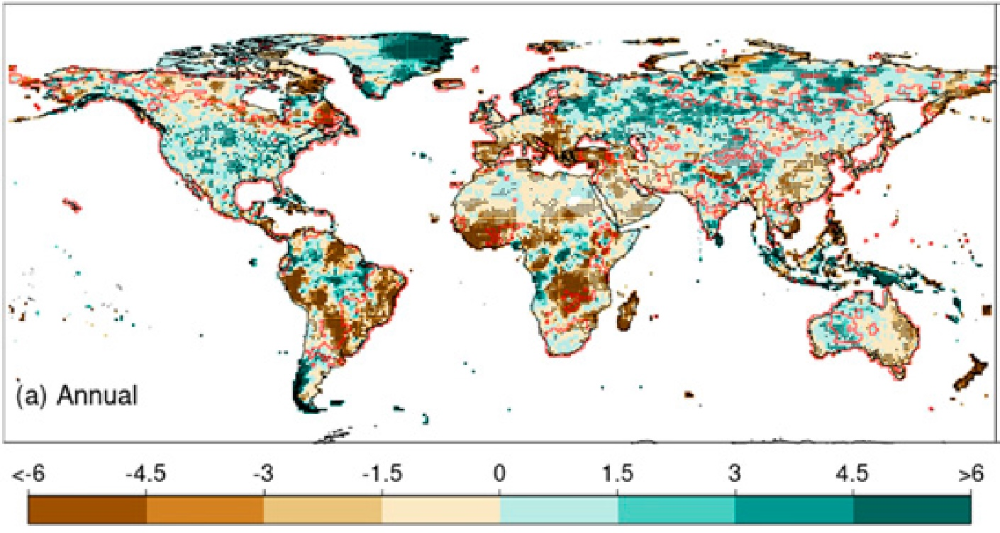

Mean precipitation intensity changes between 1950-1983 and 1984-2016 (%)

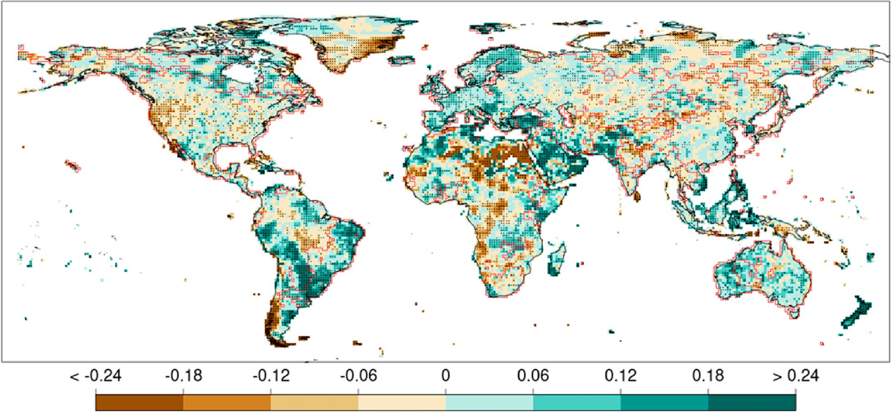

---

# Changes across the precipitation distribution between 1950-1983 and 1984-2016

- Spatially, changes in precipitation seem complex, even stochastic at first
- But a clear signal of positive precipitation changes in the high quantiles consitent with thermodynamic expectations is apparent
- This signal dissappears for the most extreme precipitation again

Relative difference in area showing postive changes vs area showing negative changes

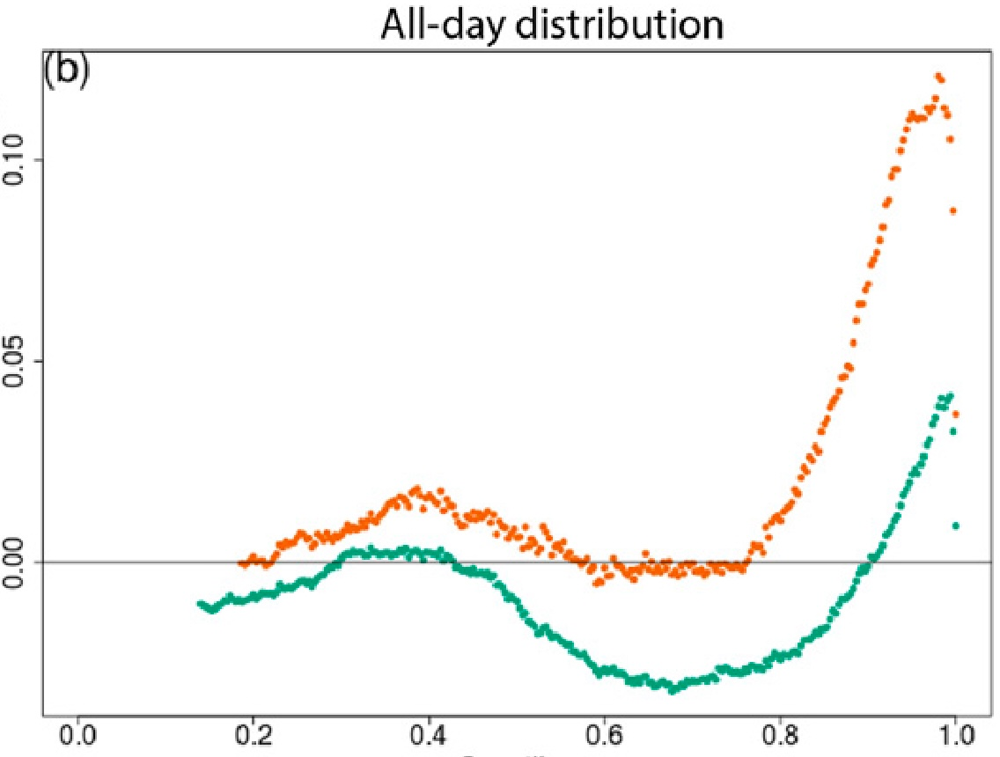

---

# Synchronous changes between frequency and intensity

- Mean changes in frequency and intensity are aligned in only around 1/3rd of the grids
- Extreme changes in frequency and intensity are aligned in almost 80% of areas globally

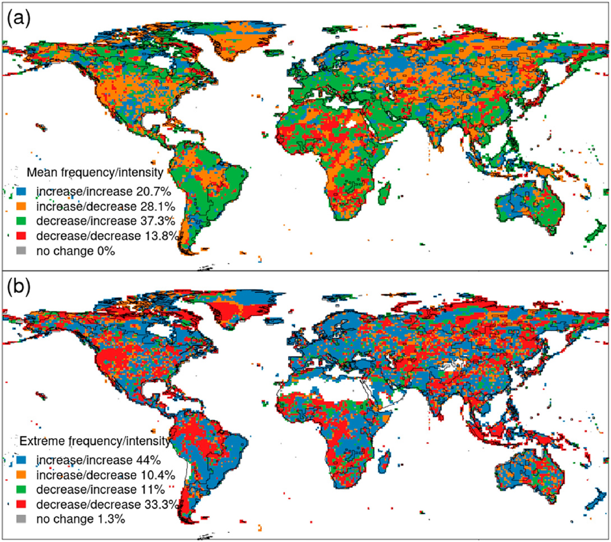

---

# (My ideal) Future of climate datasets

- All "observational" datasets are estimates from a statistical model consisting of aleatoric and epistemic uncertainties
- If we stop thinking of observations as immutable facts and instead think of them as data generating models than we can ask more meaningful questions
- E.g. for validation studies, instead of doing a grid cell by grid cell comparison we can calculate the conditional probability of the model output given the observations
- To do this we need observations to be inherently probabilistic (the entire distribution), e.g. Risser et al. 2019
- Artificial intelligence assisted inference can alleviate computational bottlenecks that traditionally made inference algorithms impractical in climate sciences, e.g. Zammit-Mangion et. al 2021 and Lenzi et. al 2023
- As the examples demonstrate even a dataset of extremes is possible with this approach

 

Risser, M. D., Paciorek, C. J., Wehner, M. F., O’Brien, T. A., & Collins, W. D. (2019). A probabilistic gridded product for daily precipitation extremes over the United States. Climate Dynamics, 53(5), 2517–2538.

Zammit-Mangion, A., Ng, T. L. J., Vu, Q., & Filippone, M. (2021). Deep Compositional Spatial Models. Journal of the American Statistical Association, 0(0), 1–47.

Lenzi, A., Bessac, J., Rudi, J., & Stein, M. L. (2023). Neural networks for parameter estimation in intractable models. Computational Statistics & Data Analysis, 185, 107762.

---

# Thank you

 

<a href="mailto:s.contractor@unsw.edu.au" aria-label="envelope">
            <i class="fas fa-envelope big-icon"></i>
</a>

<a href="https://twitter.com/stefancontracto" target="_blank" rel="noopener" aria-label="twitter">
            <i class="fab fa-twitter big-icon"></i>
</a>

<a href="https://scholar.google.co.uk/citations?user=sEnHZ3AAAAAJ" target="_blank" rel="noopener" aria-label="google-scholar">
            <i class="ai ai-google-scholar big-icon"></i>
          </a>

<a href="https://github.com/steefancontractor" target="_blank" rel="noopener" aria-label="github">
            <i class="fab fa-github big-icon"></i>
          </a>

<a href="https://www.linkedin.com/in/steefan-contractor-b375bb209/" target="_blank" rel="noopener" aria-label="linkedin">
            <i class="fab fa-linkedin big-icon"></i>
          </a>

<a href="https://mastodon.au/@stefancontracto" target="_blank" rel="noopener" aria-label="mastodon">
            <i class="fab fa-mastodon big-icon"></i>
          </a>