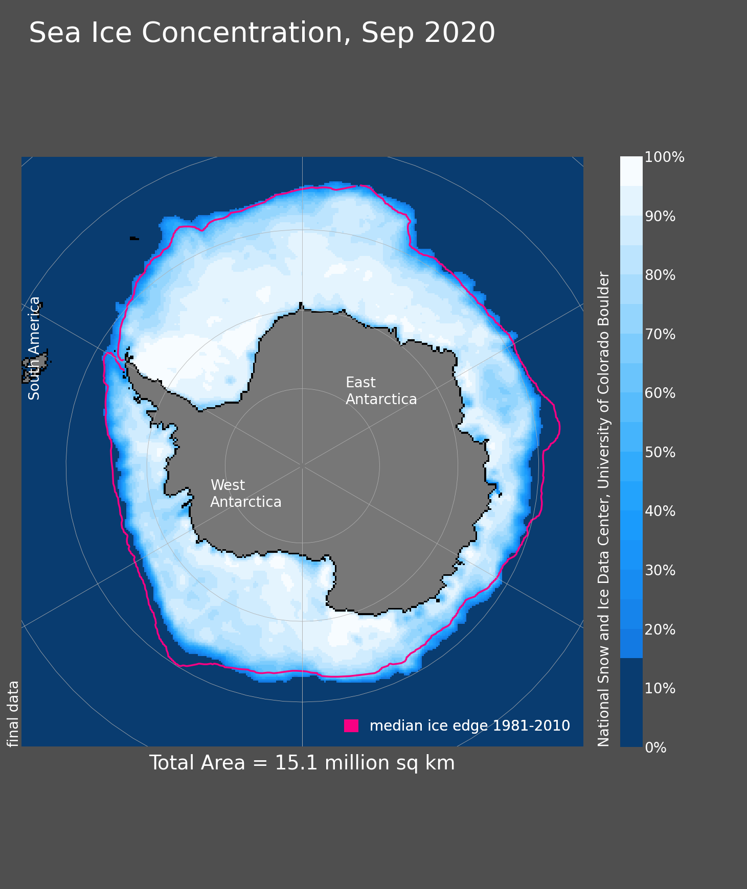
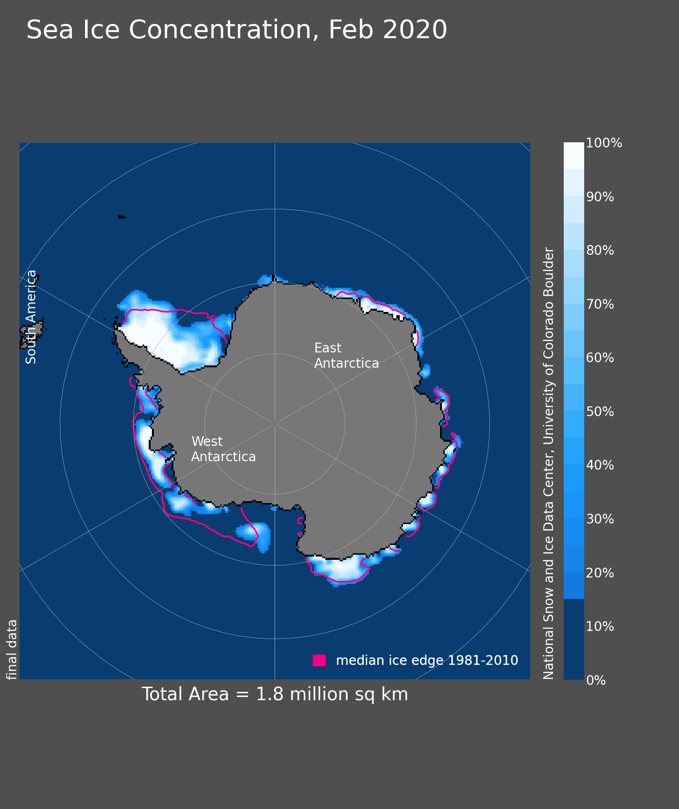
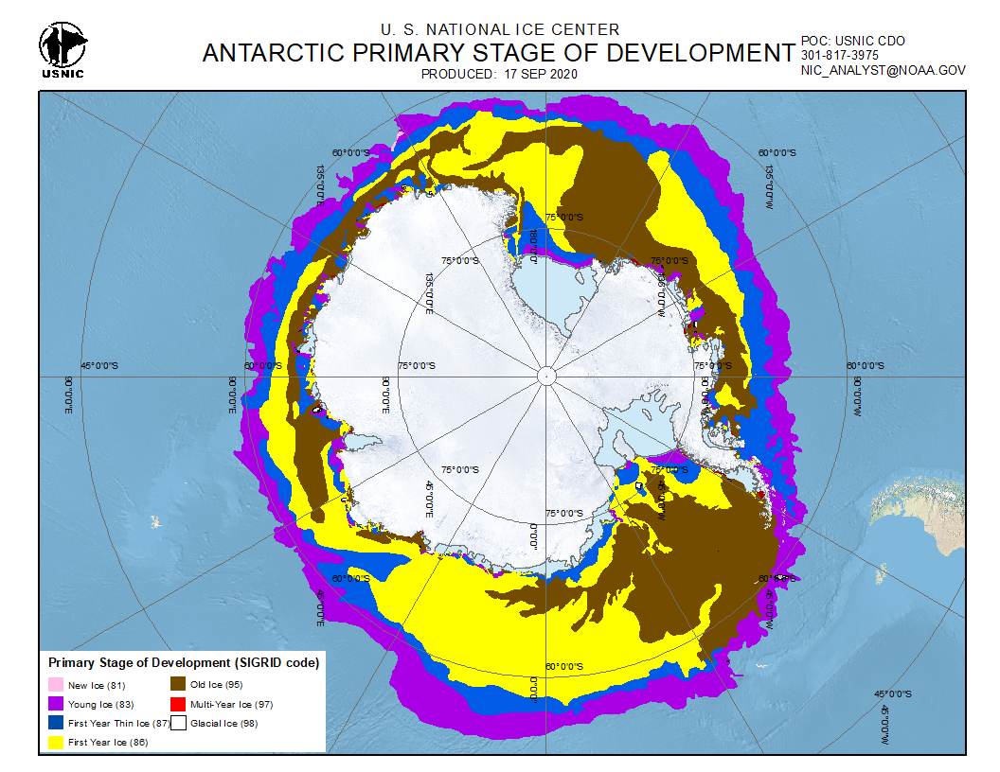
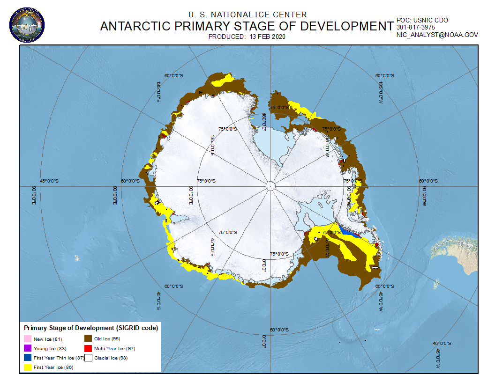

<link rel="stylesheet" href="reveal_custom.css">

<link rel="stylesheet" href="https://cdn.jsdelivr.net/gh/jpswalsh/academicons@1/css/academicons.min.css">

  
  
  
  
  

# Bayesian updates to multi-age Antarctic sea-ice concentrations using GNSS-R data

Steefan Contractor

---

<section data-background-image="https://images.unsplash.com/photo-1549598685-0058b114c9d6?q=80&w=3078&auto=format&fit=crop&ixlib=rb-4.0.3&ixid=M3wxMjA3fDB8MHxwaG90by1wYWdlfHx8fGVufDB8fHx8fA%3D%3D" data-background-opacity=0.3>

## Sea Ice

- Floating ice that forms from the freezing of seawater
- Melting and formation of sea ice affects the ocean salinity and heat content
- The changes in ocean density and temperature affect the ocean circulation as evidenced by recent coverage on AMOC weakening
- It affects the Earth's energy balance by reflecting ten times more sunlight compared to water
- It acts like a blanket affecting not just heat exchange between the ocean and atmosphere but also gases
- Through the changes in polar air masses it also affects atmospheric circulation

</section>

---

<section data-background-image="./img/sea-ice-types.png" data-background-opacity=1.0 data-background-size=80%>

---

Image sources:

- [Novel application of GNSS-R data from TechDemoSat-1 to monitoring the cryosphere, Jessica Cartwright](https://www.researchgate.net/publication/353599050_Novel_applications_of_GNSS-R_data_from_TechDemoSat-1_to_monitoring_the_cryosphere)
- https://www.ccin.ca/ccw/seaice/overview/types
- Australian Antarctic Program
  - https://www.antarctica.gov.au/site/assets/files/47686/rs13801_rich-youd-2014-04-07-2x1a8995-lpr.1024x0.jpg
  - https://www.antarctica.gov.au/site/assets/files/47686/mawson-grease-ice-2016-jennifer-wressell.1200x0.jpg
- https://www.sciencefriday.com/wp-content/uploads/2017/02/fce480147c3334975973a38782f1382c-min.jpg
- https://www.youtube.com/watch?v=_iTBQiE2CuM
- https://johnenglander.net/wp/wp-content/uploads/2018/05/young-sea-ice.jpeg
- [WMO Sea Ice Nomenclature WMO-No. 259](https://library.wmo.int/records/item/41953-wmo-sea-ice-nomenclature)

</section>

---

**Young Ice (YI)**
- Newly formed ice
- can be rough or smooth
- less than 30cm thick

**First-year Ice (FYI)**
- Ice that has survived one summer melt season
- can be level, rough or have ridges
- 30cm to 2m thick

**Multi-year Ice (MYI)**
- Ice that has survived more than one summer melt season
- typically smoother than FYI
- Over 2.5m thick and hence protrudes above the waterline
- has extremely low salinity compared to YI and FYI 

---

## Remote Sensing of Sea Ice

- Active sensors
  - Radar altimeters (CrysoSat-2)
  - Laser altimeters (IceSat-2)
  - Scatterometers (Metop A/B/C - ASCAT)
  - Synthetic Aperture Radar (Radarsat-2)
- Passive sensors
  - Passive microwave radiometers (SMOS)
- Hybrid sensors
  - Global Navigation Satellite System Reflectometry - GNSS-R

---

## GNSS-R

<section data-background-image="./img/AdobeStock_429767427.jpeg" data-background-opacity=0.5 data-background-size="cover">

  

</section>

---

## IUP Multiyear ice concentration and other sea ice types, Version AQ2 (Antarctic)

- Provides YI, FYI and MYI concentrations
- Developed by Institute of Environmental Physics, University of Bremen
- Uses passive microwave (AMSR2) and scatterometer (ASCAT instruments on Metop A/B/C) data to derive initial estimates
- Corrects the initial estimates using 2m surface air temperature and sea ice drift data
- 12.5km x 12.5km grid resolution

 Melsheimer, Christian; Spreen, Gunnar; Ye, Yufang; Shokr, Mohammed (2019): Multiyear Ice Concentration, Antarctic, 12.5 km grid, cold seasons 2013-2018 (from satellite). PANGAEA, https://doi.org/10.1594/PANGAEA.909054

---

## Sea Ice Signal in GNSS-R features?

---
<section>
<iframe src="./img/First three principal components of features coloured by water-ice label.html" width="100%" height="600px" style="border:none;"></iframe>

---

**Some details**
- PCA data: 
  - water - total ice concentration = 0%
  - ice - total ice concentration > 99%
- PCA features:
  - reflectivity1
  - snr_reflected1
  - power_reflected1
  - phase_noise1
  - excess_phase_noise1
- total explained variance: 99.25%

</section>

---

<section>

<embed src="./img/First three principal components of features coloured by ice type labels.html" width="100%" height="600px" style="border:none;"></iframe>

---

**Some details**
- PCA data: 
  - YI - YI ice concentration > 90%
  - FYI - FYI ice concentration > 99.9%
  - MYI - MYI ice concentration > 99%
- PCA features:
  - reflectivity1
  - snr_reflected1
  - power_reflected1
  - phase_noise1
  - excess_phase_noise1
- total explained variance: 99.58%

</section>

---

## Correlation amongst GNSS-R features and ice types

---

<section>

## Geographic distribution

---

= 80%25.png" height="320px">

 

---

 National Snow and Ice Data Center, Boulder, Colorado USA. https://nsidc.org/data/seaice_index, last access: 2024-07-16

 J. C. Comiso, A. C. Bliss, R. Gersten, C. L. Parkinson, and T. Markus (2024), Current State of Sea Ice Cover, https://earth.gsfc.nasa.gov/cryo/data/current-state-sea-ice-cover, last access: 2024-07-16.

</section>

---

## Ice concentrations as probabilities

- the spatial footprint of GNSS-R grid is around 2.5% of the size of the IUP grid
- interprit ice concentration as the probabiliy of seeing that kind of ice inside that grid
- assume that the ice concentrations can be erroneous
- assume higher ice concentrations are more likely to be correct
- semi-supervised approach: learn a mapping from GNSS-R to ice labels where IUP concentrations are close to 100%
- update the IUP concentrations using the learned mapping

---
<section>

## Bayesian update

$$
\begin{align*}
P(true\, label\, |\, model\, pred) &= \frac{P(model\, pred\, |\, true\, label) \times P(true\, label)}{P(model\, pred)} \\
&= \frac{P(model\, pred\, |\, true\, label) \times P(true\, label)}{\sum_{true\, labels}{P(model\, pred\, ,\, true\, label)}} \\
&= \frac{P(model\, pred\, |\, true\, label) \times P(true\, label)}{\sum_{true\, labels}{P(model\, pred\, |\, true\, label) \times P(true\, label)}}
\end{align*}
$$

---

Two ways to get $P(model\ pred\ |\ true\ label)$:

- Using a tabular ML model - model calibration required
  - calibrate using test dataset and Bayes rule again

  
$$
P(pred\ |\ true) = \frac{P(true\ |\ pred)P(pred)}{\sum_{pred\ labels}{P(true\ |\ pred)P(pred)}}
$$

  

- Using Robust Mixture Discriminent Analysis (RMDA)

 Bouveyron, C., & Girard, S. (2009). Robust supervised classification with mixture models: Learning from data with uncertain labels. Pattern Recognition, 42(11), 2649–2658. https://doi.org/10.1016/j.patcog.2009.03.027

</section>

---

## Which ML model?

---

<section>

## Decision tree ensemble methods

- **Random Forest**: Fits an ensemble of N trees on random subsets (known as bagging) of data and predicts with a majority vote. 
- **Adaptive Gradient Boosting**: Trains N trees sequentially, each tree correcting the errors of the previous tree by weighting the data points that were misclassified. This is known as boosting.
- **Gradient Boosting**: Also a boosting method in that it trains N trees sequentially, however, instead of weighting the data points, it fits each tree to the residuals of the previous tree.

---

## LightGBM

Key improvements over vanilla gradient boosting:

- **Histogram-based splitting**: LightGBM bins the data points into discrete bins and then splits the bins instead of the data points. This reduces the complexity of the model and speeds up training.
- **Leaf-wise growth**: Instead of growing the tree level-wise, LightGBM grows the tree leaf-wise. This reduces the number of nodes in the tree and hence the complexity of the model. 
- **Gradient-based One-Side Sampling**: LightGBM samples the data points based on the gradient of the loss function. This speeds up training by focusing on the data points that are more informative.
- **Exclusive Feature Bundling**: LightGBM bundles exclusive features together to reduce the number of features that need to be considered during training.

</section>

---

<section>

## Gaussian Mixture Discriminant Analysis

\[
\begin{align*}
G &\sim Discrete(K) \\
C &\sim Discrete(L) \\
X &\in \mathbb{R}^p \\
p(x|C=i) &= \sum_{j=1}^{K} P(C=i,G=j)p(x|G=j) \\
p(x) &= \sum_{i=1}^L\sum_{j=1}^{K} P(C=i,G=j)p(x|G=j) \\
&= \sum_{i=1}^L\sum_{j=1}^{K} \pi_{ij}\phi(x;\mu_ij,\Sigma_ij)
\end{align*}
\]
Here $\pi_{ij}$ is the mixing coefficient such that $\sum_{j=1}^K \pi_{ij} = 1$, and $\phi(x;\mu_ij,\Sigma_ij)$ is the multivariate Gaussian distribution with mean $\mu_ij$ and covariance $\Sigma_ij$.

---

## Robust Mixture Discriminant Analysis

\[
\begin{align*}
p(x) &= \sum_{i=1}^L\sum_{j=1}^{K} P(C=i,G=j)p(x|G=j) \\
&= \sum_{i=1}^L\sum_{j=1}^{K} P(C=i|G=j)P(G=j)p(x|G=j) \\
&= \sum_{i=1}^L\sum_{j=1}^{K} r_{ij}\pi_j\phi(x;\mu_j,\Sigma_j) 
\end{align*}
\]
Since $\pi_j$ does not depend on $C$, we can fit a gaussian mixture model (unsupervised) to get $\pi_j$. To get the, $L\times K$, matrix $R=(r_{ij})$ parameters, we maximise the log likelihood:
\[
l(R) = \sum_{i=1}^{L}\sum_{x\in \mathcal{C}_i} log(R_i\Psi(x))
\]
where $\Psi(x) = (P(S=1|X=x),P(S=1|X=x),...,P(S=K|X=x))^t$  and $\mathcal{C}_i=\{x_l\}$ 
such that $x_l$ belongs to class $C=i$, 
w.r.t. $r_{ij}\in [0,1], \forall i\in {1,...,L}\text{ and }j\in{1,...,K}$,
subject to $\sum_{i=1}^{L} r_{ij}=1, \forall j=1,...,K$.

---

</section>

---

<section>

## Class rebalancing

<!-- LGBM confusion matrix
['YI_conc', 'FYI_conc', 'MYI_conc', 'water_conc']
[[0.59237875 0.27944573 0.0369515  0.09122402]
 [0.02884615 0.94346154 0.01884615 0.00884615]
 [0.08886389 0.64904387 0.22497188 0.03712036]
 [0.02849003 0.01745014 0.00747863 0.9465812 ]] -->

- Training score: 83.7%
- Validation score: 81.3%

|            | YI   | FYI   | MYI  | water |
|------------|------------|------------|------------|------------|
| **YI**    | 0.59237875 | 0.27944573 | 0.0369515  | 0.09122402 |
| **FYI**   | 0.02884615 | 0.94346154 | 0.01884615 | 0.00884615 |
| **MYI**   | 0.08886389 | 0.64904387 | 0.22497188 | 0.03712036 |
| **water** | 0.02849003 | 0.01745014 | 0.00747863 | 0.9465812  |

- The entire dataset contains 7.39M rows. 
- After filtering rows where we have high confidence in labels (YI>90%, FYI>99.9%, MYI>99.%,Water=100%), we are left with:
	- YI: 9801 rows
	- FYI: 28266 rows
	- MYI: 9805 rows
	- Water: 3.18M rows

**Solution**: SMOTE based class rebalancing

---

## SMOTE

- Synthetic Minority Over-sampling Technique
  1. Identify the minority class
  2. Find its nearest neighbours
  3. Generate synthetic samples by interpolating between the minority class and its neighbours

- After SMOTE each class contains 3.18M rows
- So we randomly undersampled and treated the number of samples in each class as a hyperparameter
- More sophisticated undersampling techniques (Tomek, Edited Nearest Neighbours) did note prune the dataset enough

---

## Performance after class rebalancing

|                |  |
|-----------------------------|------------|
| Number of resampled rows in each class | ~1.6M      |
| Training accuracy           | 99.34%     |
| Validation accuracy         | 99.12%     |
| Test accuracy               | 96.34%     |

**Test Confusion matrix**

|              | YI     | FYI    | MYI    | water  |
|--------------|-------------|-------------|-------------|-------------|
| **YI**  | 0.67241379  | 0.15922921  | 0.04158215  | 0.12677485  |
| **FYI** | 0.04790419  | 0.84677703  | 0.08559352  | 0.01972526  |
| **MYI** | 0.046875    | 0.25878906  | 0.64257812  | 0.05175781  |
| **water**| 0.01741254 | 0.00994283  | 0.00626461  | 0.96638002  |

</section>

---

## Updated ice probability density 

---

## UMAP (Uniform Manifold Approximation and Projection)

- UMAP is a non-linear dimensionality reduction technique that is particularly well-suited for visualizing complex data in a low-dimensional space
- UMAP assumes that high-dimensional data lies on a low-dimensional manifold embedded in the higher-dimensional space
- UMAP first constructs a weighted k-nearest neighbor graph from the high-dimensional data
- UMAP then defines a low-dimensional representation and uses stochastic gradient descent to optimize the layout of the low-dimensional points, preserving the structure of the high-dimensional graph as closely as possible
- It thus preserves both local and global structure of the data
- Supervised mode:
  - During knn graph construction, UMAP uses the labels to weight the edges in the graph so that points with the same label are closer in the low-dimensional space
  - Also adds a loss term to the optimization function that penalizes points with the same label being far apart in the low-dimensional space

--- 

## Performance after UMAP feature transformation

|                |  |
|-----------------------------|------------|
| Number of resampled rows in each class | ~300K      |
| Training accuracy           | 99.99%     |
| Validation accuracy         | 99.84%     |
| Test accuracy               | 93.34%     |

**Test Confusion matrix**

|              | YI     | FYI   | MYI    | water  |
|--------------|-------------|-------------|-------------|-------------|
| **YI**  | 0.95866935  | 0.02116935  | 0.0141129   | 0.00604839  |
| **FYI** | 0.01243201  | 0.95648796  | 0.02175602  | 0.00932401  |
| **MYI** | 0.01208459  | 0.02819738  | 0.95166163  | 0.00805639  |
| **water** | 0.04524251 | 0.00951845  | 0.02106578  | 0.92417327  |

---

## Updated ice probability density

---

### Updated geographic distribution - winter

---

### Updated geo distribution - summer

---

# Thank you

 

<a href="mailto:s.contractor@unsw.edu.au" aria-label="envelope">
            <i class="fas fa-envelope big-icon"></i>
</a>

<a href="https://twitter.com/stefancontracto" target="_blank" rel="noopener" aria-label="twitter">
            <i class="fab fa-twitter big-icon"></i>
</a>

<a href="https://scholar.google.co.uk/citations?user=sEnHZ3AAAAAJ" target="_blank" rel="noopener" aria-label="google-scholar">
            <i class="ai ai-google-scholar big-icon"></i>
          </a>

<a href="https://github.com/steefancontractor" target="_blank" rel="noopener" aria-label="github">
            <i class="fab fa-github big-icon"></i>
          </a>

<a href="https://www.linkedin.com/in/steefan-contractor-b375bb209/" target="_blank" rel="noopener" aria-label="linkedin">
            <i class="fab fa-linkedin big-icon"></i>
          </a>

<a href="https://mastodon.au/@stefancontracto" target="_blank" rel="noopener" aria-label="mastodon">
            <i class="fab fa-mastodon big-icon"></i>
          </a>