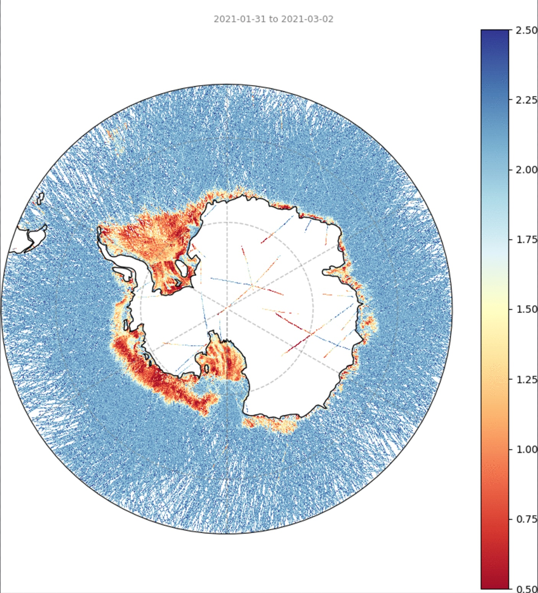
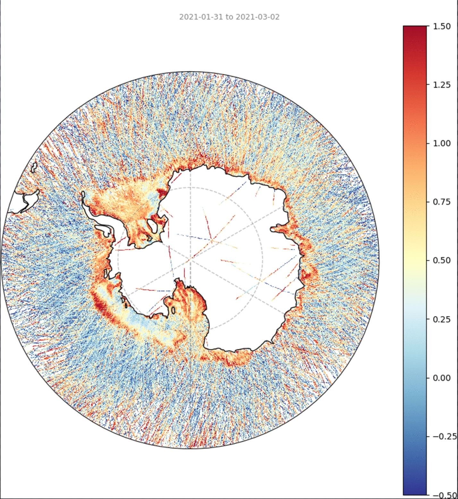
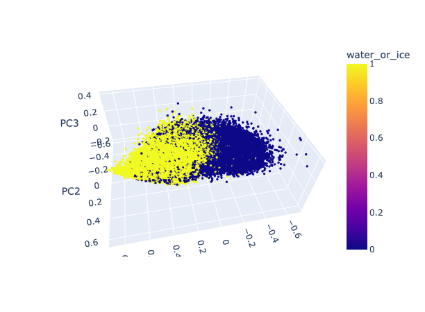
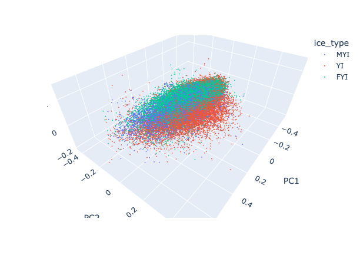

<link rel="stylesheet" href="reveal_custom.css">

<link rel="stylesheet" href="https://cdn.jsdelivr.net/gh/jpswalsh/academicons@1/css/academicons.min.css">

  
  
  
  

<section data-background-image="https://images.unsplash.com/photo-1445112098124-3e76dd67983c?q=80&w=3872&auto=format&fit=crop&ixlib=rb-4.0.3&ixid=M3wxMjA3fDB8MHxwaG90by1wYWdlfHx8fGVufDB8fHx8fA%3D%3D" data-background-opacity=0.5>

# Observing oceans from above

Dr. Steefan Contractor

</section>

---

<section data-background-image="https://images.unsplash.com/photo-1445112098124-3e76dd67983c?q=80&w=3872&auto=format&fit=crop&ixlib=rb-4.0.3&ixid=M3wxMjA3fDB8MHxwaG90by1wYWdlfHx8fGVufDB8fHx8fA%3D%3D" data-background-opacity=0.5>

# A lot happens on the ocean surface

- Interaction with the atmosphere
  - air sea heat fluxes
- Interaction with the biosphere
  - confluence of birds, fish and mammals
- Fisheries, transport, tourism and other commercial activities
- Political and Defence related activities

</section>

---

<section data-background-image="https://images.unsplash.com/photo-1528989292939-085939b5722d?q=80&w=5166&auto=format&fit=crop&ixlib=rb-4.0.3&ixid=M3wxMjA3fDB8MHxwaG90by1wYWdlfHx8fGVufDB8fHx8fA%3D%3D" data-background-opacity=1></section>

---

<section data-background-image="https://images.unsplash.com/photo-1549598685-0058b114c9d6?q=80&w=3078&auto=format&fit=crop&ixlib=rb-4.0.3&ixid=M3wxMjA3fDB8MHxwaG90by1wYWdlfHx8fGVufDB8fHx8fA%3D%3D" data-background-opacity=0.5>

# Sea Ice

</section>

---

<section data-background-image="https://images.unsplash.com/photo-1549598685-0058b114c9d6?q=80&w=3078&auto=format&fit=crop&ixlib=rb-4.0.3&ixid=M3wxMjA3fDB8MHxwaG90by1wYWdlfHx8fGVufDB8fHx8fA%3D%3D" data-background-opacity=0.5>

# Sea Ice

 

 

</section>

---

<section data-background-image="https://www.climate.gov/sites/default/files/styles/full_width_stretch_featured_image/public/2021-10/Antarctic_seaice_Oct_v_Jan_250m.jpg?itok=3hqMmRJT" data-background-position="right" data-background-size="contain">

Detecting sea ice from space

</section>

---

<section data-background-image="https://images.unsplash.com/photo-1446776811953-b23d57bd21aa?q=80&w=4928&auto=format&fit=crop&ixlib=rb-4.0.3&ixid=M3wxMjA3fDB8MHxwaG90by1wYWdlfHx8fGVufDB8fHx8fA%3D%3D" data-background-opacity=0.4>

# UK-Aus Space bridge Grant

</section>

--- 

# Global Navigation Satellite System - Reflectometry

---

# GNSS-R Features

Phase Noise

Excess Phase Noise

---

<section data-background-image="img/feature-distribution.png" data-background-position="center" data-background-size="contain">

</section>

---

<section data-background-image="img/label-distribution.png" data-background-position="center" data-background-size="contain">

</section>

--- 

# water/ice and ice type classification

---

# Thank you

 

<a href="mailto:s.contractor@unsw.edu.au" aria-label="envelope">
            <i class="fas fa-envelope big-icon"></i>
</a>

<a href="https://twitter.com/stefancontracto" target="_blank" rel="noopener" aria-label="twitter">
            <i class="fab fa-twitter big-icon"></i>
</a>

<a href="https://scholar.google.co.uk/citations?user=sEnHZ3AAAAAJ" target="_blank" rel="noopener" aria-label="google-scholar">
            <i class="ai ai-google-scholar big-icon"></i>
          </a>

<a href="https://github.com/steefancontractor" target="_blank" rel="noopener" aria-label="github">
            <i class="fab fa-github big-icon"></i>
          </a>

<a href="https://www.linkedin.com/in/steefan-contractor-b375bb209/" target="_blank" rel="noopener" aria-label="linkedin">
            <i class="fab fa-linkedin big-icon"></i>
          </a>

<a href="https://mastodon.au/@stefancontracto" target="_blank" rel="noopener" aria-label="mastodon">
            <i class="fab fa-mastodon big-icon"></i>
          </a>