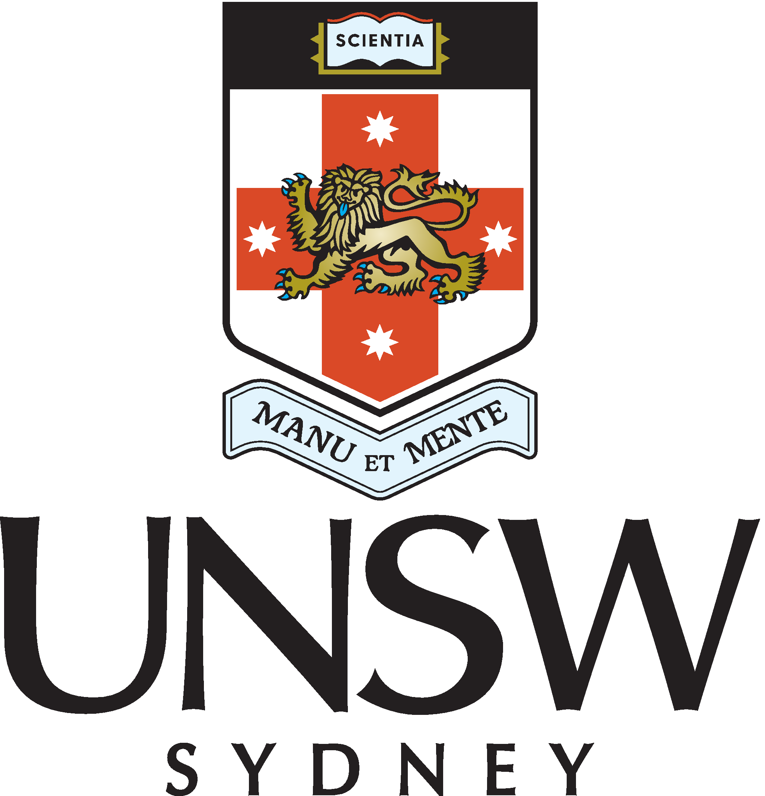
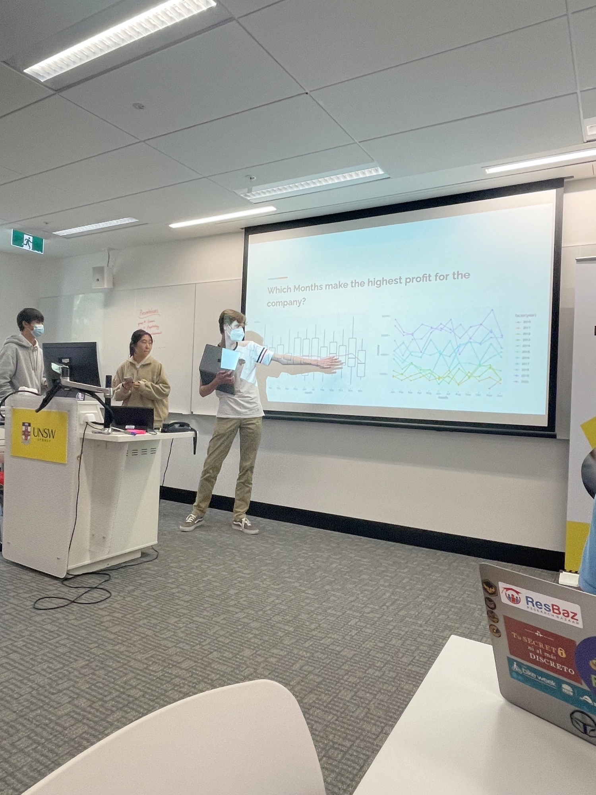
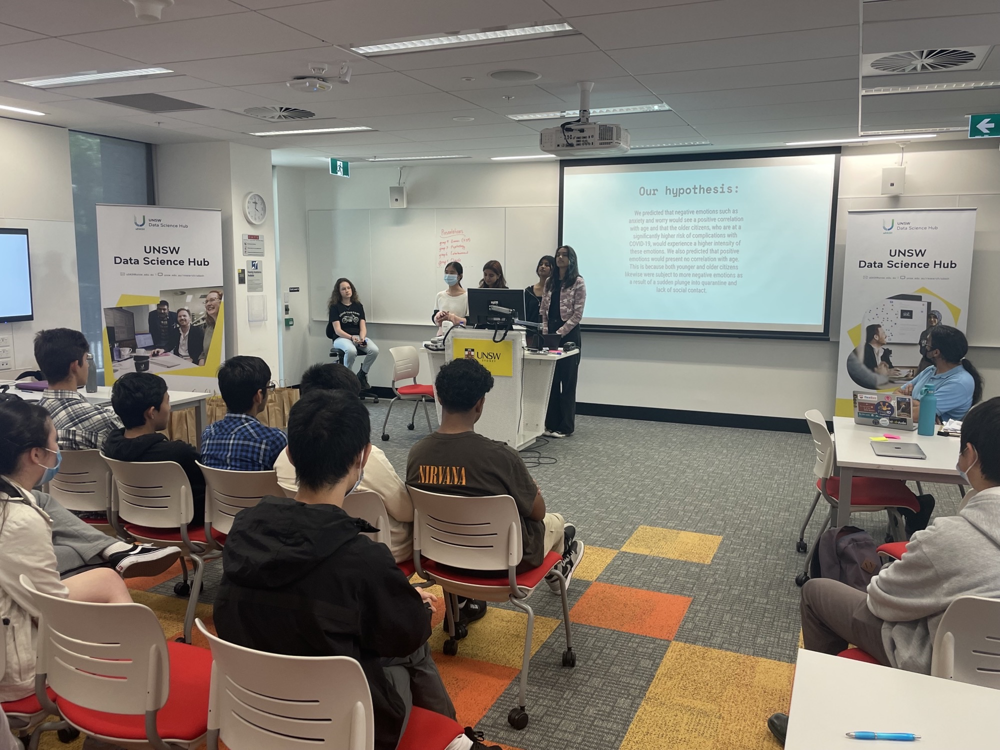

<link rel="stylesheet" href="../reveal_custom.css">

<link rel="stylesheet" href="https://cdn.jsdelivr.net/gh/jpswalsh/academicons@1/css/academicons.min.css">

  
  
  

<!-- <section data-background-image="https://media.giphy.com/media/4FQMuOKR6zQRO/giphy.gif" 
data-background-opacity=0.1
data-background-size=cover> -->

# Year 10 Data Science Work Experience Week

Welcome!

<!-- </section> -->

---

<section data-background-image="https://images.unsplash.com/photo-1669574034940-27c886b6f5bb?q=80&w=3540&auto=format&fit=crop&ixlib=rb-4.0.3&ixid=M3wxMjA3fDB8MHxwaG90by1wYWdlfHx8fGVufDB8fHx8fA%3D%3D" 
data-background-opacity=0.3
data-background-size=cover>

<!--  -->

# Acknowledgement of country

UNSW Kensington Campus is located on the unceded lands of the Bedigal people. We pay our respects to their Elders, past and present, as the Traditional Custodians of this land.

</section>

---

<section data-background-image="https://images.unsplash.com/photo-1552879890-3a06dd3a06c2?q=80&w=2754&auto=format&fit=crop&ixlib=rb-4.0.3&ixid=M3wxMjA3fDB8MHxwaG90by1wYWdlfHx8fGVufDB8fHx8fA%3D%3D" data-background-opacity=0.4>

# Health and Safety Induction

- We are following the HS414 Visitors to UNSW Facilities Guideline 
- Visitors will be met by the person organizing the visit 
- Visitors need to be accompanied and supervised by UNSW staff members or teaching assistants 
- Visitors are not allowed in medium-or high-risk areas 
- Please fill the HS630 Visitor Induction Form with your contact details and check all items that apply to the induction 
- All visitors must agree to follow any reasonable instruction in relation to health and safety. 
- Report all work related hazards, incidents, injuries and illnesses to supervising staff members or teaching assistants

</section>

---

# General safety in the classroom

- No special gear is required
- No food or drinks in the classroom
- Please keep the classroom clean and tidy
- Locate first aid equipment
- Locate fire extinguishers

You are responsible for the safety of you and others around you - Take care!

- if you see something unsafe, tell your teacher or other staff member

---

<section data-background-image="https://images.unsplash.com/photo-1583947582886-f40ec95dd752?q=80&w=2670&auto=format&fit=crop&ixlib=rb-4.0.3&ixid=M3wxMjA3fDB8MHxwaG90by1wYWdlfHx8fGVufDB8fHx8fA%3D%3D" data-background-opacity=0.4>

# Cold & Flu safety

- You are welcome to use face masks and are even encouraged to use them
- Sanitise/wash hands regularly
- if you feel unwell, please stay at home

</section>

---

<section data-background-image="./evacuation diagram d26.jpeg" data-background-position="right" data-background-size="contain">

# Emergency Procedure

In case of an emergency

- call UNSW Security Services
- do not call 000

Security Services

  - in an emergency <i class="fas fa-solid fa-phone"></i> 9385 6666
  - everything else <i class="fas fa-solid fa-phone"></i> 9385 6000

- Security Office located at Gate 2, open 24/7

<a href="https://www.student.unsw.edu.au/security">
            <i class="fas fa-solid fa-home"></i>
</a>

---

# Emergency Evacuation

- BEEP BEEP: prepare to evacuate. Do not leave until WHOOP WHOOP alarm
- WHOOP WHOOP: evacuate immediately. Follow staff and building warden instructions
- Assemble infront of John Clancy auditorium

</section>

---

# First Aid - Physical

- Location of first aid kit and first aid room (Rm G003, E26)
- Location of Automatic External Defibrillator
- Any incident requiring the use of first aid, however minor, must be reported online to UNSW 

---

<section data-background="https://images.unsplash.com/photo-1656501378122-928d5ff4153e?q=80&w=2664&auto=format&fit=crop&ixlib=rb-4.0.3&ixid=M3wxMjA3fDB8MHxwaG90by1wYWdlfHx8fGVufDB8fHx8fA%3D%3D" data-background-opacity=0.4>

# First Aid - Mental

[UNSW First Responders](https://www.unsw.edu.au/planning-assurance/safety/safer-communities/gendered-violence/find-first-responders) are students and staff who are trained to offer you confidential support. They understand that reporting gendered violence can be difficult and can provide you with guidance and support.

Scott Sisson, uDASH director <a href="mailto:uDASH@unsw.edu.au" aria-label="envelope">
            <i class="fas fa-envelope big-icon"></i> 
</a>

You can also contact a certified [ally@UNSW](https://www.edi.unsw.edu.au/get-involved/ally-network) in the School of Maths and Stats, Faculty of Science. The ally@UNSWnetwork aims to ensure UNSW is a safe and welcoming place for all LGBTIQ+ students and staff.

</section>

---

<iframe width="800" height="600" frameBorder="0" scrolling="no" marginHeight="0" marginWidth="0"src="https://use.mazemap.com/embed.html#v=1&config=unsw&campusid=111&zlevel=7&center=151.235024,-33.917283&zoom=18&sharepoitype=poi&sharepoi=1001050575&utm_medium=iframe" style={{ border: '1px solid grey' }} allow="geolocation"></iframe> <small><a href="https://www.mazemap.com/">Map by MazeMap</a></small>

---

# UNSW Year 10 Data Science Work Experience Week

## Aim

Learn the basic principles of data science. Exploratory data analysis, statistical modelling and visualisation. 

## Students will

- learn basic programming concepts
- get hands-on experience in analysing real-world datasets
- work in independent teams on data science projects 

---

# UNSW Data Science Hub (uDASH)

An official UNSW Research Centre in the School of Mathematics & Statistics
- formally established in 2021

Aim
- Bring together UNSW's full spectrum of data specialists to solve complex, real-world challenges, faced by governments and businesses

Data experts across UNSW
- 100+ data experts across UNSW's broad and diverse faculties (Science, Arts, Engineering, Medicine, Law, Business, and Aus. Defence Force Academy)
- All experts researching cutting edge applications using data science tools

<q> We translate large volumes of data into knowledge to support decision-making. ​</q>

---

# uDASH

Our expertise:
- Mathematics and Statistics
- Machine Learning and Artificial Intelligence
- Data Visualisation
- Computational modelling and simulation
- Non-linear dynamics and optimisation
- Data privacy
- Probablistic modelling
- Risk quantification and management
- Business, economics, and marketing
- Spatial modelling
- Big and complex data
- Genomics and medical data
- Ecological, environmental and climate data
- Defence research

---
# Workshop Program

<section data-background-image="https://images.unsplash.com/photo-1435527173128-983b87201f4d?q=80&w=2667&auto=format&fit=crop&ixlib=rb-4.0.3&ixid=M3wxMjA3fDB8MHxwaG90by1wYWdlfHx8fGVufDB8fHx8fA%3D%3D" data-background-opacity=0.4>

# Morning sessions 9:30am - 12:00pm

- Interactive lecture style sessions 10:00am - 12:00pm
- Special talks 9:30 - 10:00am

---

# Lunch 12:00pm - 1:30pm

- Free time to explore, get food, etc.
- Optional but recommended fun activities

  - School of Mathematics and Statistics outreach workshops (45min)
  - Datasoc campus tour (30min)

---

# Afternoon sessions 1:30pm - 4:00pm

- Independent project work
- groups of 5-6 students
- Goal: visualise patterns, postulate hypothesis, statistical analysis and discussion
- Demonstrators and instructors will give advice and recommendations

</section>

---

<section>

# Monday

Morning session:
- Induction
- Introduction to data science
- Software + Intro to programming with R 

Afternoon session:
- Intro to datasets
- Project group selection

---

# Tuesday

Morning session:
- Meet a data scientist
  - Nick Lillywhite, [BioScout](https://www.bioscout.com.au)
- Exploratory data analysis 

Afternoon session:
- Afternoon session: Work on projects (data exploration)

---

# Wednesday

Morning session:
- Meet a data scientist
  - Peter Hartmann, Westpac Group
- Statistical Modelling

Afternoon session:
- Work on projects (statistical modelling)

---

# Thursday

Morning session:
- Datasoc: who they are, how can they improve your student experience
- Data visualisation

Afternoon session:
- Work on projects (visualising results and wrap up)

---

# Friday

- Presentations
- Program wrap-up

</section>

---

<section data-background="./group.jpeg" data-background-opacity=0.7>
</section>

---

# Your instructors

Dr. Steefan Contractor

Dr. Ziyang Lyu

Dr. José Ferrer

Dr. Maeve McGillycuddy

Dr. Sean Gardiner

Dr. Peng Zhong

Dr. Boris Beranger

Dr. Prosha Rahman

<!-- Dr. Daniel Hewitt
 -->

Dr. Anikó Tóth

---

# Contacts and Socials

<a href="https://www.unsw.edu.au/research/udash">
            <i class="fas fa-solid fa-home"></i>
</a>

<a href="mailto:uDASH@unsw.edu.au" aria-label="envelope">
            <i class="fas fa-envelope big-icon"></i> 
</a>

<a href="https://twitter.com/uDASH_UNSW" target="_blank" rel="noopener" aria-label="twitter">
            <i class="fab fa-twitter big-icon"></i>
</a>

For urgent matters find my <i class="fas fa-solid fa-phone"></i> on <i class="fab fa-brands fa-slack"></i> (Slack)

---

# BREAK 

Quick stretch, walk around, switch tables

What are you most excited for during the coming week?

I go on a hike, and everytime I spot a cockatoo, I note down the temperature and atmospheric pressure. Can I use this data to investigate the relationship between temperature and pressure?

---

# What is data science?

<!-- [Survey](https://www.menti.com/alsx726rihzo) -->
[Survey](https://www.menti.com/alpf4g89qdb2)

---

<!-- 
<iframe sandbox='allow-scripts allow-same-origin allow-presentation' allowfullscreen='true' allowtransparency='true' frameborder='0' height='315' src='https://www.mentimeter.com/app/presentation/al897dcp2ng8s9vxfy74xuo7vjysb26s/embed' style='position: absolute; top: 0; left: 0; width: 100%; height: 100%;' width='420'></iframe>
 -->

<iframe sandbox='allow-scripts allow-same-origin allow-presentation' allowfullscreen='true' allowtransparency='true' frameborder='0' height='315' src='https://www.mentimeter.com/app/presentation/alepuy44anib628ejnv6poik6k8waivk/embed' style='position: absolute; top: 0; left: 0; width: 100%; height: 100%;' width='420'></iframe>

---

# Get inspired!

- Go to [//historyofdatascience.com](https://www.historyofdatascience.com/families/discover-data-science-icons/) and browse some profiles...

- Or scroll through [the timeline](https://timeline.historyofdatascience.com/) 

- Who is your favourite data science icon?
  - an 18th century pioneer?
  - a data revolutionary? a data hero?
  - an artificial intelligence Jedi?

---

<section data-background-image="https://miro.medium.com/max/720/1*T5GfsoZ-IWK3rcVkZ7R2bw.png" data-background-size="contain">
</section>

---

<section>

# The four paradigms of research

---

# Paradigm 1: Experimentation

Father of Modern science

---

# Paradigm 2: Theory led experimentation

---

# Paradigm 3: Numerical modelling

<embed src="https://earth.nullschool.net" width=90% height=500px>

---

# Paradigm 4: Data-intensive scientific discovery

The concept of these four paradigms of research was coined by Jim Gray, a 1998 Turing Award winner, in 2007.

</section>

---

# Data science is more than just prediction

--- 

# Introduction to programming with R and Rstudio